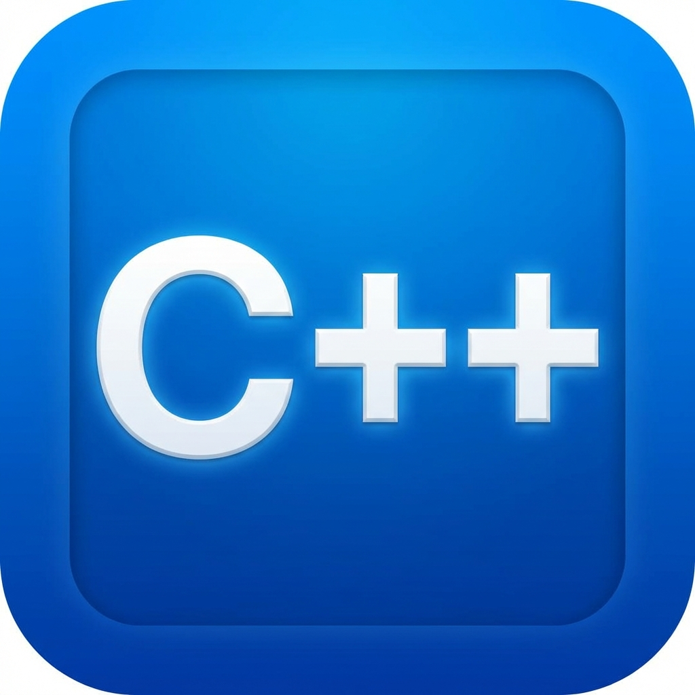

# CarbonCode 🚀

<p align="center">
  
</p>

<p align="center">
  <strong>A lightweight, offline C++ IDE built with Electron, React, and Monaco Editor.</strong>
</p>

<p align="center">
  <em>Developed by Rabail Ali Bhatti</em>
</p>

<p align="center">
  
  
  
</p>

---

CarbonCode is a modern, cross-platform C++ IDE designed for speed and simplicity. It allows you to compile and run C++ code locally using your system's installed compiler, providing a VS Code-like experience in a lightweight, offline-first package.

## 📥 Downloads

**Ready to start coding?** 
Download the latest version of CarbonCode from the [Releases](https://github.com/rabailalibhatti/carboncode/releases) page.

- **Windows**: Download the `.exe` installer.
- **macOS/Linux**: Build from source (see below) or check the latest release for supported binaries.

## ✨ Features

- 🖥️ **Modern Code Editor** - Powered by Monaco Editor (the heart of VS Code) with full C++ IntelliSense.
- 🔧 **Native Compilation** - Seamlessly integrates with `g++`, `clang++`, or `MSVC`.
- 📁 **File Management** - Full support for opening, editing, and saving `.cpp` files.
- 🎨 **Premium UI** - Sleek, dark theme with glassmorphism touches and smooth micro-animations.
- ⚡ **One-Click Run** - Hit `F5` to compile and execute your code instantly.
- 📊 **Intelligent Output** - Real-time terminal output with precise timing for compilation and execution.
- 🔢 **Standards Support** - Toggle between C++11, C++14, C++17, C++20, and C++23.
- 💾 **100% Offline** - Your code never leaves your machine.

## 📋 Prerequisites

You must have a C++ compiler installed on your system.

### 🪟 Windows (Recommended)
1. **Download**: Get the [MinGW-w64](https://www.mingw-w64.org/downloads/) installer.
2. **Install**: Choose the `x86_64` architecture during setup.
3. **Environment**: Add the `bin` folder (e.g., `C:\mingw64\bin`) to your **System PATH**.
4. **Verify**: Open a new terminal and type `g++ --version`.

### 🍎 macOS
```bash
# Install Xcode Command Line Tools
xcode-select --install
```

### 🐧 Linux
```bash
# Ubuntu/Debian
sudo apt install build-essential
# Fedora
sudo dnf install gcc-c++
```

## 🚀 Getting Started (Development)

1. **Clone & Install**
   ```bash
   git clone https://github.com/rabailalibhatti/carboncode.git
   cd carboncode
   npm install
   ```

2. **Run Development Mode**
   ```bash
   npm run dev
   ```

3. **Build Installer**
   ```bash
   npm run build
   ```

## ⌨️ Keyboard Shortcuts

| Action | Shortcut |
|--------|----------|
| **New File** | `Ctrl + N` |
| **Open File** | `Ctrl + O` |
| **Save** | `Ctrl + S` |
| **Save As** | `Ctrl + Shift + S` |
| **Compile & Run** | `F5` |
| **Quit** | `Ctrl + Q` |

## 🛠️ Technical Stack

- **Framework**: Electron
- **Frontend**: React 18 & TypeScript
- **Bundler**: Vite
- **Editor**: Monaco Editor
- **Styling**: TailwindCSS & PostCSS

## 📄 License

This project is licensed under the **MIT License** - see the [LICENSE](LICENSE) file for details.

---

<p align="center">
  Made with ❤️ by <strong>Rabail Ali Bhatti</strong>
</p>
