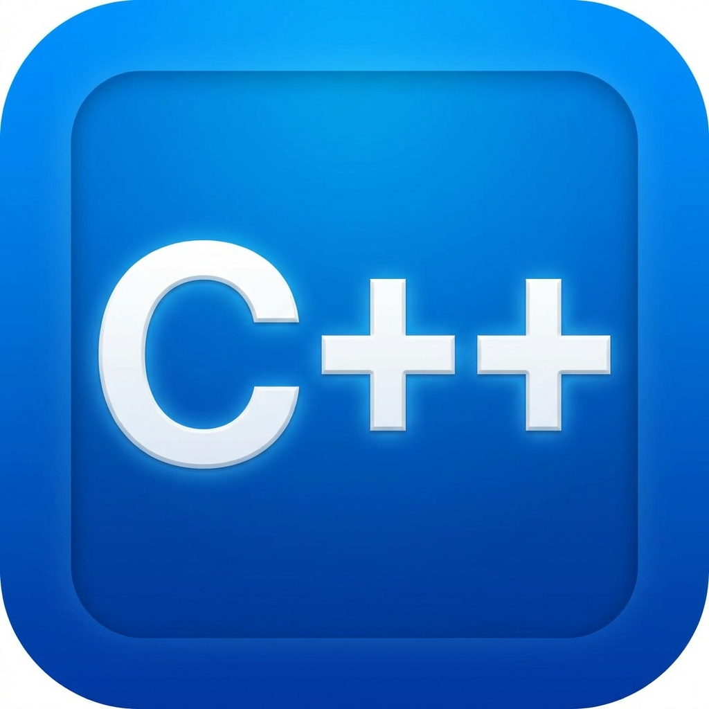

<p align="center">
  
</p>

<h1 align="center">CarbonCode</h1>

<p align="center">
  <strong>A lightweight, offline IDE for C, C++, Java, and Python</strong><br/>
  <em>Developed by Rabail Ali Bhatti</em>
</p>

<p align="center">
  
  
  
  
</p>

---

CarbonCode is a modern, cross-platform offline IDE for C, C++, Java, and Python built with Electron, React, and Monaco Editor. Compile and run your code locally using your system's installed tools or the bundled C++ compiler — 100% offline, zero internet required.

## ✨ Features

- 📂 **Full Student File Handling Support** - Practice file handling in C, C++, Java, and Python with relative paths (e.g. `data.txt`, `output.csv`) running directly in your workspace directory
- 📄 **Text & Data File Management** - Create, view, and edit `.txt`, `.csv`, `.dat`, `.in`, `.out`, `.log`, and `.json` files right from the File Explorer with distinct badges and inline creation
- 💡 **Rich File Handling IntelliSense** - Autocomplete and prebuilt snippets for `<fstream>`, `<filesystem>`, Java `File`/`Files`/`Path`/`Scanner`/`PrintWriter`, Python `open`/`pathlib`, and C `<stdio.h>`
- 🔄 **Auto-Refreshing Workspace** - Program output files (e.g. `output.txt`) immediately show up in the File Explorer upon execution
- 🐍 **Full Python Support** - Native Python 3 runner with unbuffered execution, 60+ built-ins, 35+ stdlib completions, and PEP 8 formatting
- 🖥️ **Monaco Code Editor** - VS Code-grade editor with dark navy theme, high-contrast syntax highlighting, bracket matching, and indentation guides
- 🔍 **Go to Definition & Navigation** - F12 to jump to symbol definitions, Shift+F12 for references across C, C++, Java, and Python
- 💅 **Built-in Code Formatter** - Shift+Alt+F and Format-on-Save supporting PEP 8, Java, C++, and C
- 💻 **Interactive Blinking Cursor Terminal** - Real-time inline terminal with full standard input (`cin`, `Scanner`, `input()`) support
- 🐞 **Clickable Error Diagnostics** - Automatic traceback and compilation error parsing with instant click-to-jump to line/column
- 🛠️ **Integrated Debugger** - GDB-powered line-by-line debugging with variable inspection and breakpoint support for C and C++
- 🔧 **Bundled Compiler Setup** - Comes ready out-of-the-box with bundled MinGW64 for C and C++
- 📁 **File Explorer & Global Search** - Integrated tree view and Ctrl+Shift+F project search/replace across files
- 📑 **Multi-Tab Interface** - Work on multiple files simultaneously with dirty-state tracking and unsaved change protection
- ☕ **Java JDK Support** - Automatic JDK and `javac` detection with standard library IntelliSense
- 💾 **100% Offline First** - Bundled offline Monaco Editor and local compiler runtime with zero network dependencies

## 📋 Prerequisites

**For the "Full" version:** None! It comes with a bundled C++ compiler (MinGW).

**For the "Lite" version:** You must have a C++ compiler installed on your system:

### Windows (Lite Version)
- **Option 1: MinGW-w64** (Recommended)
  1. Download from [MinGW-w64](https://www.mingw-w64.org/downloads/)
  2. Add the `bin` folder to your system PATH
  3. Verify: `g++ --version`

- **Option 2: Visual Studio Build Tools**
  1. Download [Visual Studio Build Tools](https://visualstudio.microsoft.com/downloads/)
  2. Install "Desktop development with C++"
  3. Open the "Developer Command Prompt" to compile

### macOS
```bash
# Install Xcode Command Line Tools
xcode-select --install

# Verify installation
clang++ --version
```

### Linux (Ubuntu/Debian)
```bash
# Install g++
sudo apt update
sudo apt install build-essential

# Verify installation
g++ --version
```

### Linux (Fedora)
```bash
sudo dnf install gcc-c++
```

### Linux (Arch)
```bash
sudo pacman -S gcc
```

### Java JDK (Required for Java support)

To compile and run Java programs, you need the Java Development Kit (JDK):

**Windows:**
1. Download [Eclipse Temurin JDK](https://adoptium.net/temurin/releases/) or [Oracle JDK](https://www.oracle.com/java/technologies/downloads/)
2. Install and ensure `javac` is on your PATH
3. Verify: `javac -version`

**macOS:**
```bash
# Install via Homebrew
brew install openjdk

# Verify
javac -version
```

**Linux (Ubuntu/Debian):**
```bash
sudo apt update
sudo apt install default-jdk
javac -version
```

## 🚀 Installation

### From Source

1. Clone the repository:
```bash
git clone https://github.com/rabailalibhatti/carboncode.git
cd carboncode
```

2. Install dependencies:
```bash
npm install
```

3. Run in development mode:
```bash
npm run dev
```

### Building for Distribution

You can build two versions of the installer:

**1. Lite Version (Smaller size, requires system compiler)**
```bash
npm run build:lite
# Output: release/lite/CarbonCode-Lite-x.x.x.exe
```

**2. Full Version (Includes MinGW compiler, works out of the box)**
```bash
npm run build:full
# Output: release/full/CarbonCode-Full-x.x.x.exe
```

## ⌨️ Keyboard Shortcuts

| Action | Shortcut |
|--------|----------|
| New File | `Ctrl+N` |
| Open File | `Ctrl+O` |
| Save | `Ctrl+S` |
| Save As | `Ctrl+Shift+S` |
| Find / Replace | `Ctrl+F` |
| Toggle Explorer | `Ctrl+B` |
| Compile & Run | `F5` |
| Quit | `Ctrl+Q` |

## 🔧 Selecting C++ Standard

Use the dropdown in the toolbar to select your desired C++ standard:
- C++11
- C++14
- C++17 (default)
- C++20
- C++23

## 📁 Project Structure

```
carboncode/
├── electron/           # Electron main process
│   ├── main.ts         # Main window & IPC handlers
│   ├── preload.ts      # Secure IPC bridge
│   ├── compiler.ts     # Compilation logic
│   └── debugger.ts     # GDB Debugger integration
├── src/                # React renderer process
│   ├── components/     # UI components (Editor, DebugPanel, Analytics, etc.)
│   ├── hooks/          # Custom React hooks (useFileManager, useSettings)
│   ├── App.tsx         # Main application orchestrator
│   ├── main.tsx        # React entry point
│   └── index.css       # Global styles & themes
├── public/             # Static assets (icons, etc.)
├── vendor/             # Bundled tools (MinGW-w64)
├── package.json        # Dependencies & build scripts
├── vite.config.ts      # Build configuration
└── tailwind.config.js  # Styling configuration
```

## 🛠️ Technical Stack

- **Electron** - Cross-platform desktop framework
- **React 18** - UI library with hooks
- **TypeScript** - Type-safe JavaScript
- **Vite** - Fast build tool
- **Monaco Editor** - VS Code's editor component
- **TailwindCSS** - Utility-first CSS framework
- **Java/JDK** - Java compilation and execution support

## 🔒 Security

CarbonCode follows Electron security best practices:
- Context isolation is enabled
- Node integration is disabled in the renderer
- All IPC communication goes through a secure preload script
- Temporary files are cleaned up after compilation

## 🐛 Troubleshooting

### "No compiler detected"

1. Ensure you have g++, clang++, or cl.exe installed
2. Verify the compiler is in your system PATH
3. Restart the application after installing

### Compilation times out

Your code may have an infinite loop. The execution timeout is 10 seconds.

### Compilation errors

Check the "Errors" tab in the output panel for detailed error messages from the compiler.

## 🔮 Future Enhancements — V4 Roadmap

CarbonCode V4 is actively being planned. Here's what's coming next:

### Phase 1: Smart Editor
- 🤖 **AI-Powered Code Suggestions** — Context-aware autocomplete beyond IntelliSense
- 🎨 **Custom Themes & Extensions** — User-created themes and plugin support
- 📝 **Code Snippets Library** — Reusable snippet manager with cloud sync

### Phase 2: Collaboration & Cloud
- 🌐 **Live Collaboration** — Real-time pair programming with shared cursors
- ☁️ **Cloud Sync** — Sync projects and settings across devices
- 🏫 **Classroom Mode** — Teacher dashboard with student progress tracking

### Phase 3: Advanced Tooling
- 📊 **Memory Profiler** — Visual memory leak detection and heap analysis
- 🧪 **Integrated Testing** — Built-in unit testing framework with coverage reports
- 🔗 **Git Integration** — Visual Git management (commit, branch, merge) inside the IDE

### Phase 4: Cross-Platform & Beyond
- 🐧 **Linux & macOS Installers** — Native builds for all major platforms
- 📱 **Web Version** — Browser-based CarbonCode powered by WebAssembly
- 🌍 **Multi-Language Support** — Extend to Python, Java, and Rust compilation

> 💡 Have a feature idea? [Open an issue](https://github.com/RabailAliBhatti/CarbonCode/issues) and let us know!

## 📄 License

MIT License - see LICENSE file for details.

---

<p align="center">
  <strong>CarbonCode</strong> - Made with ❤️ by <strong>Rabail Ali Bhatti</strong>
</p>
